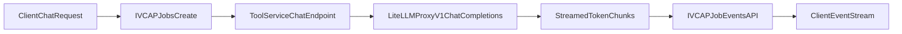

# Workflow And Chatbot Job Events Demo

This project now demonstrates two event-driven patterns over IVCAP Jobs:

1. A workflow simulator (`/`) that emits hierarchical workflow steps.
2. A chatbot tool (`/chat`) that calls a LiteLLM proxy and emits batched `chat:tokens:*` events.

The goal is to support a client chat experience that submits a chat job and renders incremental LLM output from the Job Events stream.

## Modes

## 1) Workflow Simulation Mode (`/`)

### Input

- **preset_name** (required): one of:
  - `deep_research`
  - `multi_agent_crew`
  - `simple_pipeline`
  - `timer_tick`
- **total_run_time_seconds** (optional, timer mode): total runtime, capped at 600.
- **tick_interval_seconds** (optional, timer mode): delay between ticks.

### Output

- **message**
- **preset_name**
- **phases_completed**
- **agents_executed**
- **total_events**
- **elapsed_seconds**

### Workflow Event Naming

- `workflow:{name}`
- `phase:{phase_id}`
- `agent:{phase_id}:{agent_id}`
- `agent:{phase_id}:{agent_id}:task-{n}`
- `timer:tick:{n}`

## 2) Chatbot Streaming Mode (`/chat`)

### Jobs API Routing Note (Important)

When calling the deployed service through IVCAP Jobs API (`POST /1/services2/{service_urn}/jobs`), request validation is based on the service's primary tool schema.

This service's primary request model now accepts both workflow and chat fields. Chat jobs are selected by providing:

- `$schema: urn:sd:schema.workflow-simulator.chat.request.1` (recommended), and
- `messages[]`

If you omit chat markers and also omit `preset_name`, the request is treated as invalid and may fail with `422 Unprocessable Entity`.

### Runtime Configuration

- **`LITELLM_PROXY`** (required): base URL of your LiteLLM proxy.
  - Example: `https://litellm-proxy.example.com`
  - The tool calls `POST {LITELLM_PROXY}/v1/chat/completions` with `stream=true`.
- **Auth token** for LiteLLM proxy:
  - Deployed jobs: uses runtime `JobContext.job_authorization` automatically.
  - Local runs: set **`IVCAP_JWT`** manually.

### Chat Input Schema

```json
{
  "$schema": "urn:sd:schema.workflow-simulator.chat.request.1",
  "model": "gpt-5-mini",
  "messages": [
    { "role": "system", "content": "You are concise and helpful." },
    { "role": "user", "content": "Explain why event streaming helps UX." }
  ],
  "temperature": 1,
  "max_tokens": 256
}
```

### Chat Output Schema

```json
{
  "$schema": "urn:sd:schema.workflow-simulator.chat.result.1",
  "message": "Chat completed successfully",
  "model": "gpt-5-mini",
  "response_text": "Streaming improves perceived latency by delivering partial output early.",
  "chunks_emitted": 8,
  "approx_tokens_emitted": 17,
  "total_events": 23,
  "elapsed_seconds": 1.94
}
```

### Chat Event Naming And Order

The chat tool emits steps so existing event consumers can reuse the current parser:

1. `chat:request` (request submitted / accepted)
2. `chat:response` (stream lifecycle)
3. `chat:token:{n}` for each streamed token/chunk
4. `chat:complete` once final aggregation is complete

#### Background Event Writes

Each token is emitted as its own event via a background `ThreadPoolExecutor`,
so the LLM streaming loop never blocks on the sidecar HTTP round-trip. A single
worker thread preserves event ordering while the main loop continues consuming
tokens. Before `chat:complete`, all pending writes are drained so no events are
lost.

> **Backward compatibility:** The client recognises both `chat:token:{n}`
> (singular) and `chat:tokens:{n}` (plural) prefixes.

## End-To-End Event Flow



## Vercel AI SDK Data Stream Protocol (Assessment)

For this refactor, the canonical stream stays as IVCAP Job Events envelopes. This preserves compatibility with existing Jobs API event consumers and parsing logic.

Vercel AI SDK Data Stream Protocol can still be adopted later via an adapter in the client that maps `chat:tokens:*` Job Events into AI SDK stream parts. This keeps backend transport unchanged while enabling richer frontend abstractions.

## Quick Verification

### Local Workflow Endpoint

Start the service locally:

```bash
poetry ivcap run -- --port 8078
```

In another terminal:

```bash
python3 make_request.py http://localhost:8078 tests/request.json
```

### Deployed Workflow (IVCAP Jobs API)

```bash
poetry ivcap job-exec tests/request.json -- --stream --raw-events
```

### Deployed Chat (IVCAP Jobs API)

```bash
LITELLM_PROXY=https://litellm-proxy.example.com \
IVCAP_JWT=<token-for-local-run-only> \
poetry ivcap job-exec tests/request_chat.json -- --stream --raw-events
```

You should see `chat:tokens:*` batch events during execution, followed by a final chat result payload.

## Web Client (`client/`)

The `client/` directory contains a React app with two routes:

- **`/`** -- Workflow simulation demo with real-time event streaming and timing summary.
- **`/chat`** -- ChatGPT-style chat interface for testing chat latency through the Job Events pipeline.

### Chat UI (`/chat`)

The chat page demonstrates end-to-end streaming UX:

1. User sends a message (or clicks an example prompt).
2. Client creates an IVCAP chat job.
3. While waiting for the job to start, a **"Thinking..." indicator** is shown with real-time status messages from backend events (e.g., "Submitting chat request to model 'gpt-5-mini'").
4. As token events arrive, text is appended directly into the assistant bubble with a **blinking cursor**, similar to ChatGPT. Tokens stream at the natural LLM cadence since each token is emitted as its own event via a non-blocking background thread.
5. A **timing metrics bar** above the input displays latency deltas: Submit-to-Executing, Submit-to-First-Event, Submit-to-First-Token, Submit-to-Complete.
6. A collapsible **debug panel** shows raw job events and diagnostics.

The SSE event subscription includes **retry with exponential backoff** to handle transient network errors (HTTP/2 resets, proxy timeouts).

See `client/README.md` for full details, setup instructions, and hook API reference.

The client communicates via the IVCAP Jobs API:

- `POST /1/services2/{service_urn}/jobs` -- Create job
- `GET /1/services2/{service_urn}/jobs/{job_id}` -- Poll status
- `GET /1/services2/{service_urn}/jobs/{job_id}/events` -- SSE long-poll for events
